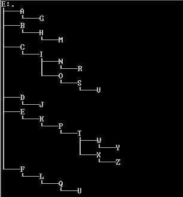

# Graphic Tree
**The program Graphic Tree is developed to determine the directory structure when there are too many folders cascaded. It is a console program developed in C language. The application creates a hierarchial view as shown below.**

<kbd></kbd>
